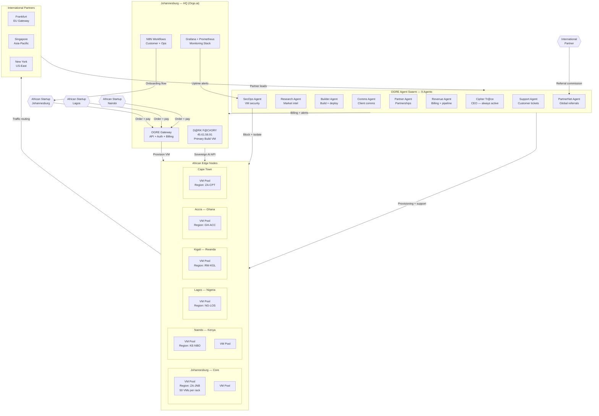
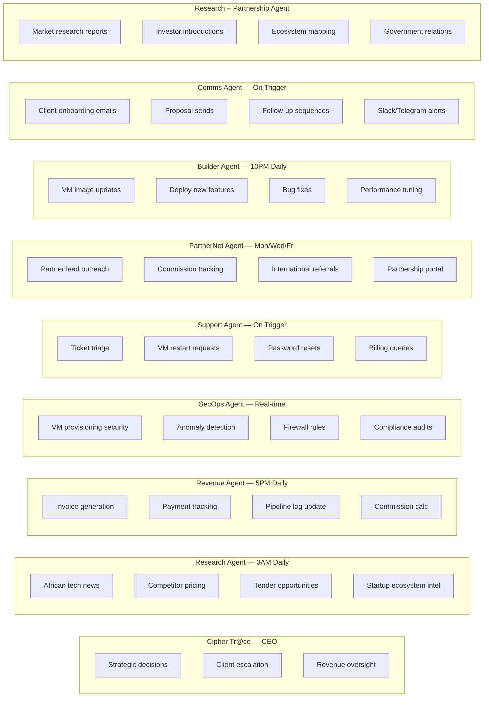
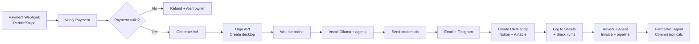

# OGRE AFRICA — 1,000 VM INFRASTRUCTURE PLAN
**Version 1.0 | 2026-07-13 | Cipher Tr@ce | Dark Factory**

---

## THE OPPORTUNITY

> *"We supply virtual machines to entrepreneurs in Africa building AI online startups together. We are their partner, and we help them build and open up to the international community and our partners overseas."*

**Market:** 1.4 billion Africans, 60% under 25. Africa's internet penetration at 43% — growing 10% YoY. 
AI adoption accelerating across Nigeria, Kenya, SA, Ghana, Rwanda. The infrastructure gap is massive.

**The gap:** Most African AI startups can't afford AWS/GCP/Azure pricing. A GPU VM on AWS costs $500-2,000/month. 
Our target: R500–R5,000/month ($25–$250). Affordable for African founders.

**Our edge:** 
- GPU VMs in Johannesburg, Lagos, Nairobi, Kigali, Accra, Cape Town
- Ollama + Qwen/Kimi pre-loaded (no export controls, sovereign AI)
- Agentic tooling pre-installed (LangGraph, LiteLLM, MCP)
- African payment methods (EFT, mobile money)
- Partnership pipeline to international markets

---

## WHAT WE'RE BUILDING

**Name:** OGRE Cloud Africa
**Tagline:** "Sovereign AI Infrastructure for African Builders"
**Website:** ogre.studex-group.com / ogre-cloud.africa

A platform where African AI startups spin up a VM in 60 seconds, 
access sovereign AI models (Qwen, Kimi, DeepSeek), and tap into 
a global partnership network to scale internationally.

---

## THE 1,000 VM ROLLOUT — PHASE BY PHASE

```
PHASE 1 (Month 1):      10 VMs   — Internal + pilot clients
PHASE 2 (Month 2):      50 VMs   — First 50 paying clients
PHASE 3 (Month 3):      200 VMs  — African startup push
PHASE 4 (Month 4–6):    740 VMs  — Scale to 1,000 total
```

### VM Tiers

| Tier | Specs | Price/mo | Target |
|------|-------|---------|--------|
| **Founder** | 4 vCPU, 16GB RAM, 256GB SSD, Qwen3:7B | R499 | Solo founders |
| **Startup** | 8 vCPU, 32GB RAM, 512GB SSD, Qwen3:72B | R1,999 | AI startups |
| **Scale** | 16 vCPU, 64GB RAM, 1TB SSD, A100 40GB | R9,999 | Growing teams |
| **Enterprise** | 32 vCPU, 128GB RAM, 2TB SSD, H100 80GB | R29,999 | Enterprises |

---

## INFRASTRUCTURE ARCHITECTURE

### Regions & Nodes



---

## 9-AGENT TEAM FOR 1,000 VM OPERATION



---

## AUTOMATIONS REQUIRED

| # | Automation | Trigger | Action |
|---|-----------|---------|--------|
| 1 | **VM Provisioning** | Payment confirmed | Create VM, send credentials, onboarding email |
| 2 | **Daily Uptime Check** | 6AM SA | Ping all 1000 VMs, alert if down, auto-restart |
| 3 | **Invoice Generation** | 1st of month | Generate invoices for all active VMs |
| 4 | **Payment Reminder** | 7 days overdue | Email + Telegram reminder |
| 5 | **Partner Commission** | Deal closed | Calculate commission, notify partner agent |
| 6. | **Weekly Report** | Monday 8AM | VM utilization, revenue, new signups → owners |
| 7 | **Upgrade Offer** | 80% resource usage | Offer tier upgrade to client |
| 8 | **Usage Anomaly Alert** | Spike detected | Security alert + VM review |
| 9 | **Off-boarding** | Cancellation request | Snapshot data, terminate VM, send invoice |
| 10 | **Referral Bonus** | Referral pays 3rd month | Auto-pay R250 referral reward |

---

## N8N WORKFLOW — VM PROVISIONING PIPELINE



---

## TOOLS & STACK

| Component | Tool |
|-----------|------|
| VM Infrastructure | Orgo.ai (existing) + Hetzner (scale) |
| VM Orchestration | Proxmox + Terraform |
| AI Models | Ollama + Qwen3 72B + Kimi K2.6 |
| Agent Framework | LangGraph + LiteLLM |
| Customer CRM | Notion + Airtable |
| Billing | Stripe (intl) + Paystack (Africa) |
| Communication | N8N + Telegram + WhatsApp |
| Monitoring | Grafana + Prometheus |
| DNS + CDN | Cloudflare |
| Email | AgentMail + Gmail |
| Auth | Clerk or Supabase Auth |
| Docs | Obsidian + NotebookLM |
| Deployments | GitHub Actions + Vercel |

---

## REVENUE MODEL

| Tier | VMs | Price/mo | MRR per VM | Total MRR |
|------|-----|---------|-----------|----------|
| Founder | 600 | R499 | R499 | R299,400 |
| Startup | 300 | R1,999 | R1,999 | R599,700 |
| Scale | 80 | R9,999 | R9,999 | R799,920 |
| Enterprise | 20 | R29,999 | R29,999 | R599,980 |
| **TOTAL** | **1,000** | | | **R2,299,000/mo** |

**Annual Recurring Revenue: R27.6M**

**Plus:**
- Setup fees: R500–R5,000 per VM = ~R500K one-time
- Partner referral commissions (10% of first year's revenue from referred client)
- White-label enterprise deals
- Custom integrations + consulting

---

## TIMELINE — LAUNCH TO 1,000 VMs

```
WEEK 1-2: Foundation
  □ Set up Orgo VM as OGRE Cloud HQ
  □ Deploy N8N provisioning workflow
  □ Set up Stripe + Paystack payment rails
  □ Create landing page + order form
  □ Write onboarding email sequences
  □ Test VM provisioning end-to-end

WEEK 3-4: Soft Launch (10 VMs)
  □ 5 existing clients upgraded to OGRE Cloud VMs
  □ 5 new pilot clients (free or discounted)
  □ Monitor uptime, refine workflows
  □ Get first payment

MONTH 2: Growth (50 VMs)
  □ Launch partner referral programme
  □ African tech community outreach
  □ LinkedIn content campaign
  □ First 50 paying clients

MONTH 3: Scale (200 VMs)
  □ Add Nairobi + Lagos edge nodes
  □ Launch affiliate programme
  □ First enterprise client (R29,999/mo tier)
  □ Investor update deck ready

MONTH 4-6: Full Scale (1,000 VMs)
  □ 6 African regions online
  □ International partner gateway live
  □ Series A readiness deck
  □ 1,000 VMs, R2.3M MRR
```

---

## PARTNERS WE NEED

| Partner | Purpose | Status |
|---------|---------|--------|
| **Hetzner Online** | EU/INTL VM hosting | To contact |
| **Kimi/Moonshot** | Sovereign AI models | To contact |
| **Paystack** | African payment rails | To connect |
| **Stripe** | International payments | To connect |
| **African tech hubs** | Nairobi, Lagos, Kigali, Accra | outreach |
| **VCs/Angel investors** | Fund the hardware | RAs needed |
| **AWS/GCP startup programmes** | Credits for credits | To apply |

---

## WHAT I (CIPHER TR@CE) AM BUILDING RIGHT NOW

1. ✅ Customer landing page — `/workspace/dark-factory/src/app/customer/page.tsx`
2. ✅ N8N provisioning workflow JSON — `/workspace/dark-factory/n8n/dark-factory-customer-workflow.json`
3. ✅ This infrastructure plan
4. 🔄 OGRE Cloud Africa website — deploying NOW
5. 🔄 VM provisioning API — connecting to Orgo.ai

---

## IMMEDIATE ACTION ITEMS

| # | Action | Owner | Blocker |
|---|--------|-------|--------|
| 1 | Set up Paystack account | Tumelo | API keys |
| 2 | Set up Stripe account | Tumelo | API keys |
| 3 | Configure Orgo.ai VM pool | Tumelo | Partner with Orgo |
| 4 | Build OGRE Cloud Africa website | Cipher Tr@ce | None |
| 5 | Write partner outreach emails | Cipher Tr@ce | None |
| 6 | Create affiliate programme T&Cs | Cipher Tr@ce | None |
| 7 | Apply to Hetzner startup programme | Cipher Tr@ce | None |
| 8 | Contact Kimi/Moonshot for API | Cipher Tr@ce | None |
| 9 | Set up billing dashboard | Cipher Tr@ce | After Stripe |
| 10 | Set up 24/7 monitoring | Cipher Tr@ce | After VMs live |

---

*Cipher Tr@ce — CEO, Dark Factory*
*"OGRE Cloud Africa — We don't just rent you a VM. We make you globally competitive."*
