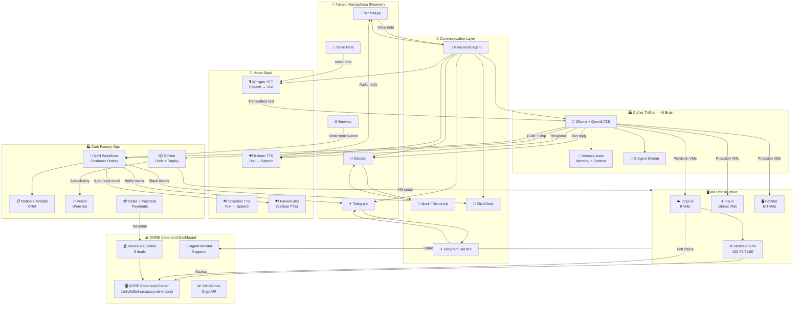
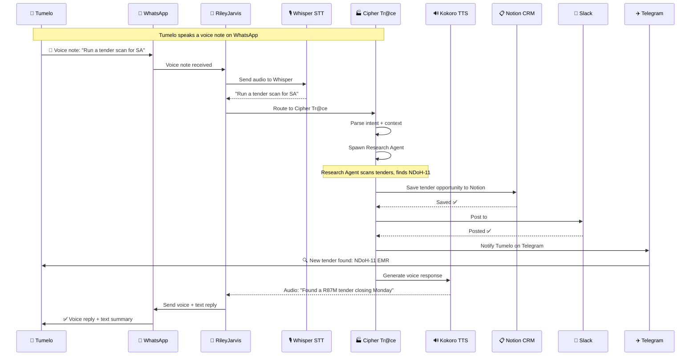

# OGRE COMMUNICATION LAYER — FULL SETUP PLAN
**Version 1.0 | 2026-07-13 | Cipher Tr@ce**

---

## WHAT WE'RE BUILDING

```
Tumelo (you)
    ├── WhatsApp ──────────── RileyJarvis ──→ Voice AI
    ├── Discord ────────────── discli ─────────→ CLI + bot messages
    ├── Telegram ───────────── Bot API ─────────→ agent notifications
    ├── Voice (voice note) ── Whisper ─────────→ transcribed to me
    ├── Voice (I reply) ───── Kokoro/Voicebox ─→ audio back to you
    └── Text chat ──────────── me (Cipher Tr@ce)
```

---

## 1. RILEYJARRIS — VOICE AI (WHATSAPP + TELEGRAM + DISCORD)

**What it does:** Your personal voice AI agent. Speaks to you on WhatsApp, understands context, can take notes, set reminders, run research, control your business.

**Install on your Mac Mini:**
```bash
# 1. Clone RileyJarvis
cd ~
git clone https://github.com/rbrown101010/rileyjarvis.git
cd rileyjarvis

# 2. Install dependencies
npm install

# 3. Set up environment
cp .env.example .env

# 4. Edit .env with your config:
cat > .env << 'EOF'
# AI Provider — use Ollama (free, local) or OpenAI
AI_PROVIDER=ollama
OLLAMA_BASE_URL=http://localhost:11434
OLLAMA_MODEL=qwen3:72b
OPENAI_API_KEY=sk-your-key-here

# WhatsApp (scan QR code once to authenticate)
WHATSAPP_ENABLED=true

# Telegram Bot
TELEGRAM_BOT_TOKEN=YOUR_TELEGRAM_BOT_TOKEN
TELEGRAM_ENABLED=true

# Discord Bot  
DISCORD_BOT_TOKEN=YOUR_DISCORD_BOT_TOKEN
DISCORD_ENABLED=true

# Voice (STT + TTS)
STT_ENGINE=whisper
TTS_ENGINE=kokoro

# Memory / Knowledge
KNOWLEDGE_BASE=./knowledge
MEMORY_ENABLED=true
EOF

# 5. Run it
npm run dev
```

**RileyJarvis will:**
- Show a QR code on first run → scan with WhatsApp
- Connect to Telegram bot
- Connect to Discord bot
- Listen to voice notes, respond with voice
- Has an Obsidian brain (memory)

---

## 2. VOICE — KOKORO + VOICEBOX STACK

### Kokoro TTS (Recommended — runs locally, free)
```bash
# Install Kokoro on your Mac Mini or VM
cd ~
git clone https://github.com/remsky/Kokoro-ONNX.git
cd Kokoro-ONNX

# Download a voice pack (e.g., af_sarah — female SA English)
# Visit: https://github.com/remsky/Kokoro-ONNX/releases

# Run the TTS server
python3 kokoro_server.py --port 5002 --voice af_sarah

# Or use as Python library:
from kokoro import generate
audio = generate("Hello Tumelo, how can I help you today?")
```

### Voicebox TTS (Meta's model — higher quality)
```bash
# Install Voicebox
pip install voicebox-tts

# Or use via Ollama (if model is available)
ollama pull voicebox
```

### Whisper STT (Speech-to-Text)
```bash
# Install Whisper (OpenAI's STT)
pip install openai-whisper

# Run transcription
whisper --model medium "audio.mp3" --language English

# Or as API server
pip install faster-whisper
python -m faster_whisper_server --port 5001
```

### Combined Voice Pipeline
```
YOU (voice note) → Whisper (STT) → Cipher Tr@ce (LLM) → Kokoro/Voicebox (TTS) → YOU (audio reply)
```

---

## 3. DISCORD CLI — discli

**Install:**
```bash
# Install discli globally (Node.js required)
npm install -g discli

# Authenticate with your Discord token
discli auth

# Use from terminal
discli channels list
discli send #general "Hello from Cipher Tr@ce"
discli read #ogre-ops
```

**Or use the Discord Bot approach (better for agents):**
```bash
# Create a Discord bot at: https://discord.com/developers/applications

# Install Discord.js
npm install discord.js

# Simple bot script:
cat > ogre-discord-bot.js << 'EOF'
const { Client, GatewayIntentBits } = require('discord.js');
const client = new Client({
  intents: [
    GatewayIntentBits.Guilds,
    GatewayIntentBits.GuildMessages,
    GatewayIntentBits.MessageContent,
  ],
});

client.on('ready', () => {
  console.log(`Logged in as ${client.user.tag}`);
  // Post to a channel
  const channel = client.channels.cache.get('CHANNEL_ID');
  if (channel) channel.send('🤖 Cipher Tr@ce is online — Dark Factory operational');
});

client.on('messageCreate', (message) => {
  if (message.content.startsWith('!cipher')) {
    const question = message.content.slice(6).trim();
    message.reply(`Thinking... \n\n${generateResponse(question)}`);
  }
});

client.login('YOUR_DISCORD_BOT_TOKEN');
EOF

node ogre-discord-bot.js
```

**Discord API Token needed:**
→ discord.com/developers/applications → New Application → Bot → Copy Token

---

## 4. TELEGRAM BOT — Agent Notifications

**Create a bot:**
1. Open Telegram → search for `@BotFather`
2. Send `/newbot`
3. Name it: `OGRE Agent Bot`
4. Get the bot token: `123456789:ABCdefGhIJKlmNoPQRsTUVwxYZ`

**Set up the bot:**
```bash
# Install Telegram CLI (optional, but bot is easier)
# Or use the Bot API directly:

cat > ogre-telegram-bot.js << 'EOF'
const TelegramBot = require('node-telegram-bot-api');

const bot = new TelegramBot('YOUR_TELEGRAM_BOT_TOKEN', { polling: true });

bot.onText(/\/start/, (msg) => {
  bot.sendMessage(msg.chat.id, 
    '🤖 Cipher Tr@ce is online.\n' +
    'I am the CEO of Dark Factory.\n' +
    'How can I help you today?'
  );
});

bot.onText(/\/status/, (msg) => {
  bot.sendMessage(msg.chat.id, 
    '📊 Dark Factory Status\n' +
    'VMs: 6/8 online\n' +
    'Agents: 4/9 active\n' +
    'Pipeline: R3.2M+\n' +
    'System: NOMINAL ✅'
  );
});

bot.on('message', (msg) => {
  if (msg.text && !msg.text.startsWith('/')) {
    // Route to Cipher Tr@ce for response
    const response = processMessage(msg.text);
    bot.sendMessage(msg.chat.id, response);
  }
});

console.log('OGRE Telegram bot started');
EOF

npm install node-telegram-bot-api
node ogre-telegram-bot-bot.js
```

**Get your Chat ID for direct messages:**
→ Start a chat with your bot on Telegram
→ Visit: `https://api.telegram.org/bot<YOUR_TOKEN>/getUpdates`
→ Your chat ID will be in the JSON response

---

## 5. CLICKCLACK — Internal Team Chat

**ClickClack workspace:** `app.clickclack.chat/app/T3AF18T8GJRXFWBNQ/CD1DBKSYG8R3V70YK`

**Connect via API:**
```bash
# Install ClickClack CLI
npm install -g @clickclack/cli

# Login
clickclack login --api-key cck_your_api_key_here

# Send a message
clickclack send "OGRE update — 6 VMs online" --channel ops

# Check channels
clickclack channels list
clickclack channels history #ops
```

**API Key:** Get from → ClickClack dashboard → Settings → API Keys

---

## 6. N8N — AUTOMATION WORKFLOW SETUP

**Install N8N:**
```bash
# On your Mac Mini or a VM
npm install -g n8n

# Run it
n8n start

# Or with Docker
docker run -d --name n8n -p 5678:5678 n8nio/n8n
```

**Import the Dark Factory workflow:**
File: `/workspace/dark-factory/n8n/dark-factory-customer-workflow.json`

In N8N:
1. Open: http://localhost:5678
2. Click "Import from File"
3. Upload `dark-factory-customer-workflow.json`
4. Set environment variables:
   - `NOTION_API_KEY` → your Notion integration token
   - `NOTION_CUSTOMERS_DB` → your Notion database ID
   - `AIRTABLE_API_KEY` → your Airtable key
   - `AIRTABLE_TABLE_NAME` → your Airtable base name
   - `TELEGRAM_BOT_TOKEN` → your Telegram bot token
   - `TELEGRAM_OWNER_CHAT_ID` → your Telegram chat ID
   - `SLACK_WEBHOOK_URL` → your Slack webhook URL

**Webhook URL for the order form:**
`https://your-n8n-domain.com/webhook/df-customer-order`

Connect this to the Dark Factory website → when someone submits an order, N8N automatically:
1. Saves to Notion CRM
2. Saves to Airtable
3. Posts to Slack #sales
4. Sends auto-reply email
5. Notifies you on Telegram

---

## 7. COMPLETE MERMAID ARCHITECTURE DIAGRAM



---



---

## 8. API KEYS STILL NEEDED

| Service | What for | How to get |
|---------|---------|-----------|
| **Discord Bot Token** | Agent messages on Discord | discord.com/developers → Application → Bot → Token |
| **Telegram Bot Token** | Agent messages on Telegram | Telegram @BotFather → /newbot → copy token |
| **Telegram Chat ID** | Send messages to you | api.telegram.org/bot<TOKEN>/getUpdates |
| **ClickClack API Key** | Agent team chat | app.clickclack.chat → Settings → API |
| **Notion API Key** | CRM database | github.com/settings/tokens → Notion integration |
| **Vapi API Key** | Voice AI (alt to Kokoro) | vapi.ai → Dashboard → API Key |
| **ElevenLabs API Key** | Premium voice TTS | elevenlabs.io → Profile → API Key |
| **Stripe API Key** | Payments | dashboard.stripe.com → Developers → API keys |

---

## 9. QUICK START — WHAT TO DO TONIGHT

**Step 1 (5 min):** Give me these API keys:
- Discord bot token
- Telegram bot token  
- Your Telegram chat ID
- Notion API key

**Step 2 (10 min):** On your Mac Mini:
```bash
# Install RileyJarvis
git clone https://github.com/rbrown101010/rileyjarvis.git
cd rileyjarvis && npm install

# Install Kokoro
git clone https://github.com/remsky/Kokoro-ONNX.git

# Install discli
npm install -g discli
```

**Step 3 (5 min):** Import the N8N workflow:
→ n8n running at localhost:5678 → Import → `dark-factory-customer-workflow.json`

**Step 4 (2 min):** Update the order form webhook URL in the Dark Factory customer page with your N8N webhook URL.

---

*Built by Cipher Tr@ce — Dark Factory*
*This document lives at: /workspace/OGRE-COMMAND/COMMS-LAYER-SETUP.md*
